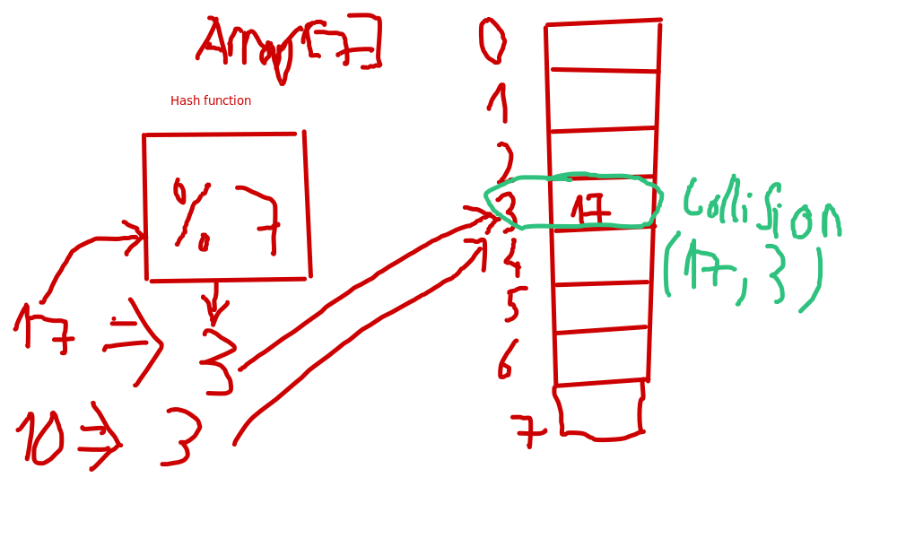
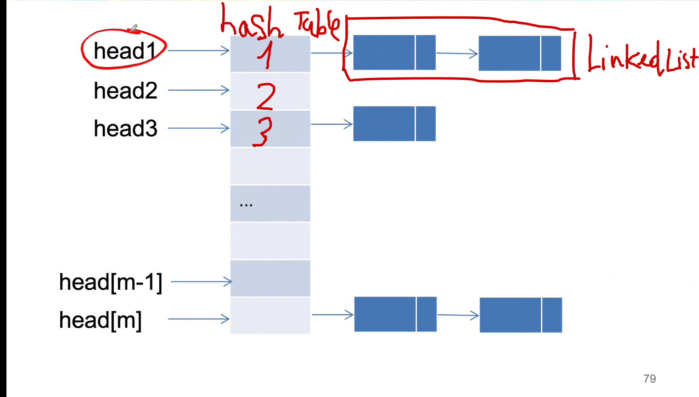

# Arrays and Strings

- ## Hash Table
  A hash table is a data structure that maps **keys to values** (like dictionnary)
  - **Look up time** : **Ideal** : O(1), **Worst** : O(N) - N is number of keys
  - **Hash function** : Convert values to key (Mostly use % modulo)
    - **Good hash function** :
          1. **Easy to compute**
          2. **Evenly distributed**
          3. **Colision rarely occurs**
  - **Process** :
      - Compute the hash codes by using hash function
      - Map the hash code to an index in array (2 different hash codes maybe have the same index). Because values are infinite (123, "A",909...) but key (index) is finite (Array[7])
   
  - **Collsion** : 2 different keys have the same hash code
  
    * #### Notes :
      * When we use **modulo(%) P(prime)**, the result will only between **0 and P-1**
    * **How to solve collsion ?**
      * **Chaining method** : Use linked list. Every index (bucket) in array is a linked list
       

        * Direct chaining : 
        * Unite chaining :    
      * **Open adressing** :  
  

# ArrayList and Resizable Arrays

